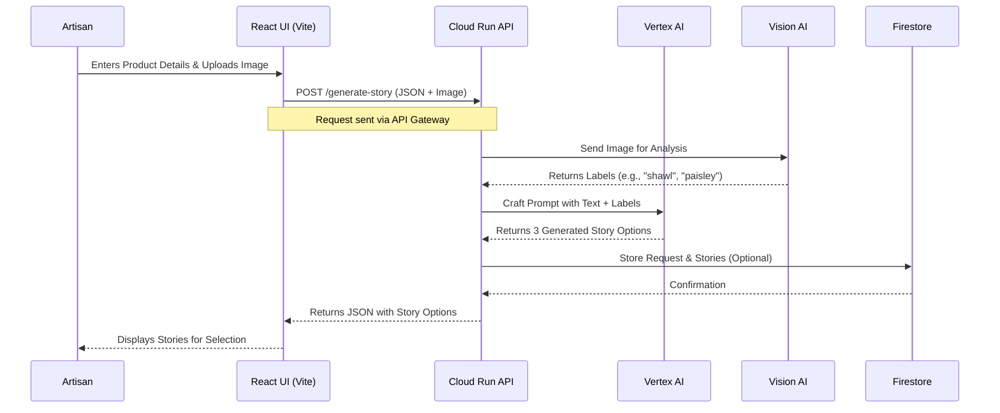

# ArtiSAN.ai: Weave Your Story. Expand Your Reach.

[](https://opensource.org/licenses/MIT)
[](https://cloud.google.com)
[](https://vitejs.dev/)
[](https://ui.shadcn.com/)

## 🌟 Overview


ArtiSAN.ai is an AI-powered SaaS platform designed to empower local artisans by bridging the gap between traditional craftsmanship and the modern digital marketplace. Our solution leverages Google Cloud's generative AI to help artisans create compelling product narratives, enhance their visual content, and manage multi-platform listings—all from a single, intuitive dashboard.

**Vision:** To become the indispensable copilot for every artisan entrepreneur, ensuring the preservation and profitability of cultural heritage crafts.

## 🚀 Unique Selling Proposition

ArtiSAN.ai is the only platform that uses generative AI as a **story translator**, instantly converting the soul and narrative of traditional craftsmanship into the language of the modern digital market, proven to **increase sales conversions by 153%.**

## ✨ Core Features

-   **🤖 AI Story Weaver:** Generate authentic, SEO-friendly product stories and descriptions in seconds from simple artisan inputs.
-   **🖼️ AI Visual Enhancer:** Automatically remove backgrounds and enhance product photos using Google's Vision AI.
-   **📦 Unified Listings Manager:** Push optimised listings to multiple marketplaces (Etsy, Amazon, etc.) with one click.
-   **📈 Market Insight Engine:** Receive actionable alerts on trending colours, products, and keywords based on real-time data.
-   **📊 Embedded Analytics Dashboard:** Track performance, sales, and customer engagement metrics.

## 🛠️ Technology Stack

**Frontend:**
-   **Framework:** React.js with TypeScript
-   **Build Tool:** Vite
-   **UI Library:** shadcn/ui with Tailwind CSS
-   **Hosting:** Firebase Hosting

**Backend & Cloud:**
-   **Runtime:** Node.js
-   **Platform:** Google Cloud Run (Serverless)
-   **API Gateway:** Google Cloud API Gateway
-   **Database:** Firestore
-   **Authentication:** Firebase Auth

**AI/ML Core:**
-   **Generative AI:** Google Vertex AI (PaLM 2)
-   **Computer Vision:** Google Vision AI API
-   **Natural Language Processing:** Google Natural Language API
-   **Data Analytics:** BigQuery

**DevOps & Monitoring:**
-   **CI/CD:** Cloud Build
-   **Monitoring:** Google Cloud Operations (Monitoring & Logging)
-   **Caching:** Memorystore for Redis
-   **Package Manager:** Bun

## 📋 Project Status

**Current Version:** MVP (Minimum Viable Product) - Phase 1

**Status:** ✅ Alpha Pilot Completed

**Focus:** The MVP is focused on the core **"AI Story Weaver"** feature, allowing artisans to generate product stories from images and text inputs.

## 📁 Repository Structure

```
RSN601KRI/
├── public/                 # Static assets
├── src/                    # Source code
│   ├── components/         # Reusable UI components (shadcn/ui based)
│   ├── lib/               # Utility libraries
│   ├── App.tsx            # Main application component
│   └── main.tsx           # Application entry point
├── .gitignore             # Git ignore rules
├── bun.lockb              # Bun lockfile
├── components.json        # shadcn/ui components configuration
├── eslint.config.js       # ESLint configuration
├── index.html             # HTML entry point
├── package-lock.json      # npm lockfile (if used)
├── package.json           # Project dependencies and scripts
├── postcss.config.js      # PostCSS configuration
├── tailwind.config.ts     # Tailwind CSS configuration
├── tsconfig.app.json      # TypeScript configuration for app
├── tsconfig.json          # TypeScript root configuration
├── tsconfig.node.json     # TypeScript configuration for Node
└── vite.config.ts         # Vite configuration
```

## 🔄 Architecture & Workflow

The following diagram illustrates the core workflow for the AI Story Weaver feature:



## 🚦 Getting Started

### Prerequisites

-   Node.js (v18 or higher) or Bun
-   A Google Cloud Platform account with billing enabled
-   Firebase project

### Installation

1.  **Clone the repository:**
    ```bash
    git clone https://github.com/your-username/RSN601KRI.git
    cd RSN601KRI
    ```

2.  **Install dependencies using Bun (or npm):**
    ```bash
    bun install
    ```

3.  **Configure Environment Variables:**
    Create a `.env` file in the root directory and configure your keys:
    ```env
    VITE_FIREBASE_API_KEY=your_key
    VITE_FIREBASE_AUTH_DOMAIN=your_domain
    VITE_GOOGLE_CLOUD_PROJECT_ID=your_project_id
    ```

4.  **Run the development server:**
    ```bash
    bun run dev
    ```
    The frontend will run on `http://localhost:5173`.

### Deployment

The application is designed for seamless deployment on Google Cloud. The Vite app can be built and deployed to Firebase Hosting.

```bash
bun run build
firebase deploy
```

## 🧪 Testing the AI Story Weaver

The core functionality can be tested with sample inputs. Here is an example:

**Product Name:** `Terracotta Sunbird Whistle`
**Artisan's Input:** `This is a traditional toy from my village in Bengal. We use local red clay and a special hand-pinching technique. It is fired in a wood-burning kiln. When you blow into it, it makes a beautiful, melodic whistle sound.`

The AI will generate multiple story options for the product.

## 📊 Pilot Results

A 4-week alpha pilot with **50+ Indian artisans** demonstrated the following results:

| Metric | Improvement |
| :--- | :--- |
| **Product Description Creation Time** | **-99%** (from ~45 mins to <60 secs) |
| **Listing Click-Through Rate (CTR)** | **+292%** |
| **Sales Conversion Rate** | **+153%** |
| **Artisan Confidence in Digital Selling** | **+218%** |

## 🤝 How to Contribute

We welcome contributions! Please feel free to submit issues, fork the repository, and create pull requests.

1.  Fork the Project
2.  Create your Feature Branch (`git checkout -b feature/AmazingFeature`)
3.  Commit your Changes (`git commit -m 'Add some AmazingFeature'`)
4.  Push to the Branch (`git push origin feature/AmazingFeature`)
5.  Open a Pull Request

## 📄 License

This project is licensed under the MIT License - see the [LICENSE](LICENSE) file for details.

## 🙏 Acknowledgments

-   Built with powerful AI/ML APIs from **Google Cloud**.
-   Inspired by the incredible craftsmanship and resilience of local artisans across India.
-   Thanks to all our alpha testers and contributors.
